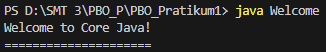
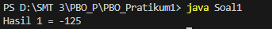
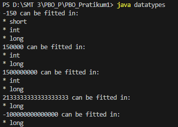
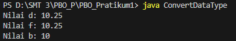
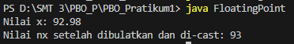
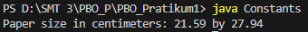
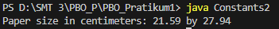
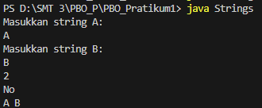

# Java Fundamental - Praktikum 1 PBO

Repositori ini berisi kumpulan kode sumber Java untuk tugas praktikum pertama mata kuliah **Pemrograman Berorientasi Objek (PBO)**.

Proyek ini bertujuan untuk mendemonstrasikan pemahaman dasar mengenai sintaks Java, tipe data, variabel, penggunaan konstanta, dan manipulasi string.

## 📂 Daftar Program & Screenshot

Berikut adalah rincian program yang ada dalam repositori ini beserta fungsinya:

### 1. Welcome (`Welcome.java`)
Program pengenalan sederhana yang menampilkan pesan sambutan dan menggunakan perulangan (loop) dasar.
> **Output:**
> 

### 2. Soal 1: Byte Overflow (`Soal1.java`)
Mendemonstrasikan apa yang terjadi ketika tipe data `byte` melebihi kapasitas maksimumnya (overflow).
> **Output:**
> 

### 3. Data Types Fitting (`datatypes.java`)
Program untuk mengecek apakah sebuah angka input (long) muat dimasukkan ke dalam tipe data `byte`, `short`, `int`, atau `long`.
> **Output:**
> 

### 4. Konversi Tipe Data (`ConvertDataType.java`)
Menunjukkan cara kerja *casting* (konversi tipe data) dari `double` ke `float`, lalu ke `byte` melalui method, serta memahami *narrowing conversion*.
> **Output:**
> 

### 5. Floating Point Rounding (`FloatingPoint.java`)
Menggunakan `Math.round()` untuk membulatkan bilangan desimal (`double`) menjadi bilangan bulat terdekat (`int`).
> **Output:**
> 

### 6. Konstanta Lokal (`Constants.java`)
Contoh penggunaan kata kunci `final` untuk membuat konstanta di dalam sebuah metode.
> **Output:**
> 

### 7. Konstanta Kelas (`Constants2.java`)
Contoh penggunaan `public static final` untuk membuat konstanta global yang bisa diakses oleh semua metode dalam kelas.
> **Output:**
> 

### 8. Manipulasi String (`Strings.java`)
Program yang menerima input dua string dan melakukan operasi:
- Menghitung total panjang karakter.
- Membandingkan secara leksikografis (abjad).
- Mengkapitalisasi huruf pertama.
> **Output:**
> 

---

## 🚀 Cara Menjalankan (How to Run)

Pastikan kamu sudah menginstal **JDK (Java Development Kit)** di komputermu.

1. **Buka Terminal / Command Prompt**.
2. **Arahkan ke direktori folder ini**:
   ```bash
   cd path/to/JavaFund-pr1-PBO_P
3. **Compile dan Run Program**:
   Gunakan perintah berikut untuk mengkompilasi (`javac`) dan menjalankan (`java`) setiap program.

   | Nama File | Perintah Compile | Perintah Run |
   | :--- | :--- | :--- |
   | **Welcome** | `javac Welcome.java` | `java Welcome` |
   | **Soal 1** | `javac Soal1.java` | `java Soal1` |
   | **Data Types** | `javac datatypes.java` | `java datatypes` |
   | **Convert Data Type** | `javac ConvertDataType.java` | `java ConvertDataType` |
   | **Floating Point** | `javac FloatingPoint.java` | `java FloatingPoint` |
   | **Constants** | `javac Constants.java` | `java Constants` |
   | **Constants 2** | `javac Constants2.java` | `java Constants2` |
   | **Strings** | `javac Strings.java` | `java Strings` |

## 👤 Identitas Pengirim

| | |
| :--- | :--- |
| **Nama** | : Qlio Amanda Febriany |
| **NIM** | : 241511087 |
| **Kelas** | : 2C |
| **Prodi** | : D3 Teknik Informatika |